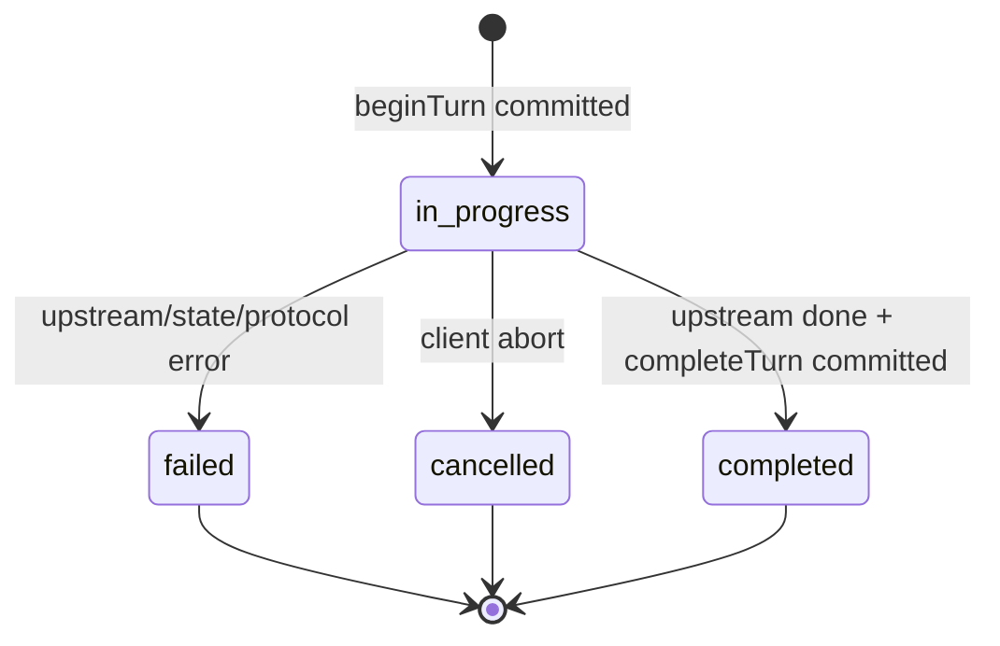
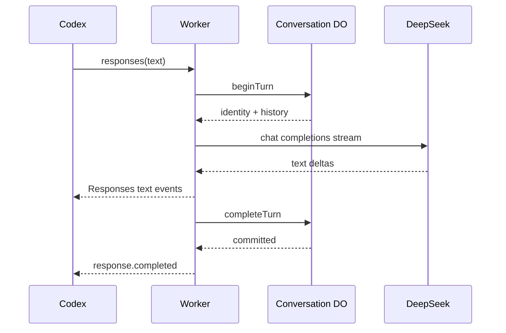

# MVP-C 技术设计

日期：2026-06-19
状态：实施基线

## 1. 目标与边界

本文细化 [最终方案](./最终方案.md) 中从 MVP-A 到 MVP-C 的实现。最终能力是：Codex 通过 Responses API 使用 DeepSeek 完成流式文本、单/并行函数调用、`previous_response_id` 恢复和 thinking + tools 多回合。

设计继续遵守单维护者、单用户、低并发定位：

- Cloudflare Worker 是唯一公网入口；
- DeepSeek Chat Completions 是唯一上游；
- MVP-A 可无状态，但 MVP-C 使用 SQLite-backed Durable Object；
- 工具始终由 Codex 客户端执行，服务端不建立 tool loop；
- 不支持多租户、Hosted tools、MCP 执行、多模态、WebSocket 和通用 Responses 兼容层；
- 未被固定 Codex 版本 fixture 覆盖的字段一律明确拒绝。

## 2. 设计原则

1. **状态与流分离。** Worker 负责 HTTP、上游调用和 SSE；DO 只负责会话的原子状态变化。
2. **存储是事实来源。** 进入 stateful 路径后，服务端保存的 assistant/tool turn 是 DeepSeek 历史的事实来源，客户端不能覆盖它。
3. **先预留、后调用、再提交。** 每个回合执行 `begin -> stream -> complete/fail`，避免并发请求消费同一工具输出。
4. **原始值不重建。** `reasoning_content` 和函数 arguments 以原始 UTF-8 字节保存，不能 parse 后重新序列化。
5. **SSE 是状态机。** 事件生成器维护 item 生命周期和最终 output，不靠散落的字符串拼接。
6. **失败不能伪装成功。** 只有上游完成且 DO 提交成功后才发送 `response.completed`。

## 3. 总体架构

```mermaid
flowchart LR
    C["Codex Desktop / CLI"] -->|"POST /v1/responses"| R["Worker HTTP boundary"]
    R --> A["Auth + request validation"]
    A --> N["Responses normalizer"]
    N --> I["Response ID verifier"]
    I --> S["Conversation state client"]
    S --> D["Conversation Durable Object + SQLite"]
    N --> P["Conversation planner"]
    D --> P
    P --> M["Model policy + DeepSeek request builder"]
    M --> U["DeepSeek upstream client"]
    U --> X["DeepSeek SSE decoder"]
    X --> E["Responses event builder"]
    E -->|"SSE"| C
    E --> F["Turn accumulator"]
    F --> S
```



请求主路径：

1. HTTP boundary 完成鉴权、大小和 Content-Type 校验。
2. normalizer 将允许的 Responses 输入转换为内部 `NormalizedTurn`。
3. 无 `previous_response_id` 时生成 conversation id；有时先验签并恢复 conversation id 与 parent sequence。
4. Worker 调用 DO `beginTurn()`，原子校验 parent、消费工具输出并创建 `in_progress` response。
5. planner 使用 DO 返回的历史和当前输入生成 DeepSeek messages。
6. upstream client 发起请求；decoder 和 event builder 边读边输出，同时 accumulator 保存原始 assistant 结果。
7. 上游正常结束后先调用 DO `completeTurn()`；成功后才输出 `response.completed`。
8. 上游错误、客户端取消或状态提交失败时调用 DO `failTurn()`，并输出已冻结的失败事件。

## 4. 工程结构

```text
src/
  index.ts
  config.ts
  http/
    router.ts
    auth.ts
    errors.ts
  responses/
    schema.ts
    normalize.ts
    types.ts
  deepseek/
    types.ts
    model-policy.ts
    request-builder.ts
    client.ts
    sse-decoder.ts
  stream/
    event-builder.ts
    accumulator.ts
    pipeline.ts
  state/
    response-id.ts
    state-client.ts
    conversation-do.ts
    schema.ts
  observability.ts
test/
  unit/
  fixtures/
  integration/
fixtures/
  codex/<exact-version>/
  deepseek/<date>/
examples/
  hello-codex.md
```

规则：模块只通过本文定义的类型接口协作；`router.ts` 不解析 DeepSeek chunk，`event-builder.ts` 不访问存储，`conversation-do.ts` 不持有 DeepSeek API key。

## 5. 核心类型

```ts
type ResponseStatus = "in_progress" | "completed" | "failed" | "cancelled";

interface ResponseIdentity {
  conversationId: string;
  sequence: number;
  responseId: string;
  parentSequence: number | null;
}

interface NormalizedTurn {
  modelAlias: string;
  instructions: string | null;
  inputMessages: NormalizedMessage[];
  toolOutputs: ToolOutput[];
  tools: NormalizedTool[];
  toolChoice: NormalizedToolChoice;
  parallelToolCalls: boolean;
  reasoningEffort: "none" | "low" | "medium" | "high" | "xhigh";
  previousResponseId: string | null;
  requestFingerprint: string;
}

interface BeginTurnResult {
  identity: ResponseIdentity;
  history: DeepSeekMessage[];
  pinnedModel: string;
}

interface AssistantTurnResult {
  content: Uint8Array;
  reasoningContent: Uint8Array;
  toolCalls: StoredToolCall[];
  finishReason: string | null;
  usage: Usage | null;
}
```

`requestFingerprint` 是规范化请求的 SHA-256，只用于冲突诊断；MVP-C 不承诺流式响应重放。

## 6. 模块详细设计

### 6.1 Worker 入口与路由

入口只暴露：

| 路由 | 行为 |
|---|---|
| `POST /v1/responses` | Responses 主路径；MVP-C 仍只支持 `stream=true` |
| `GET /v1/models` | 返回 `deepseek-codex` 及当前能力标记 |
| `GET /healthz` | 不访问上游或 DO，只证明 Worker 可运行 |

执行顺序固定为：方法与路径 -> body 大小 -> Content-Type -> Bearer token -> JSON parse -> schema validation。错误统一由 `http/errors.ts` 生成，不允许模块自行返回不同形状。

MVP 初始限制：请求体 1 MiB、单 message 256 KiB、单 tool output 256 KiB、最多 128 个 input items、最多 64 个 tools。限制集中在 `config.ts`，测试覆盖边界值。

### 6.2 鉴权

- Codex 使用 `CODEX_GATEWAY_API_KEY` 发送 Bearer token；
- Worker 使用 secret `ADAPTER_BEARER_TOKEN` 校验；
- 比较使用固定时间字节比较，不记录 header；
- DeepSeek key 只存在 secret `DEEPSEEK_API_KEY`，仅 `deepseek/client.ts` 可读取；
- MVP-C 不实现用户、session、JWT 或 per-user quota。

### 6.3 Responses schema 与 normalizer

`schema.ts` 维护显式白名单。MVP-C 接受：

- `model`、`stream=true`、`instructions`；
- string input；
- `message` item 的文本 content；
- function tools、`tool_choice`、`parallel_tool_calls`；
- `function_call_output`；
- `previous_response_id`；
- `reasoning.effort`。

normalizer 的责任：

1. 将顶层 `instructions` 规范化为唯一 system message；
2. 保持 message 和 tool output 的原始顺序；
3. 将 Responses function tool 的扁平字段转换为内部工具结构；
4. 校验 tool name、JSON Schema 和 `call_id`，但不执行工具；
5. 计算 request fingerprint；
6. 对未知字段或 item 返回带字段路径的 400。

normalizer 不做模型选择、历史恢复或 SSE 输出。

MVP-A 兼容固定 Codex 客户端默认附带的声明型 tools：只校验数组上限并记录
`declaredTools=true`，文本 request builder 不转发它们，`/v1/models` 明确标记
`tools=false`。除 `tool_choice=auto` 外的工具选择和任何工具输入 item 仍返回 400；T05
启用 function tool 结构化转换后移除此兼容降级。

### 6.4 模型策略

Codex 只使用别名 `deepseek-codex`。`model-policy.ts` 根据能力探测结果选择上游模型：

| Codex effort | DeepSeek thinking | reasoning effort |
|---|---|---|
| `none` | `disabled` | 不发送 |
| `low` / `medium` | `enabled` | `high` |
| `high` | `enabled` | `high` |
| `xhigh` | `enabled` | `max` |

真实模型来自 `UPSTREAM_TEXT_MODEL` 与 `UPSTREAM_REASONING_MODEL`，只能使用 capability fixture 已验证的组合；否则启动失败，而不是运行时静默降级。

Phase -1 已证明两个配置默认都可使用 `deepseek-v4-flash`，并允许显式配置
`deepseek-v4-pro`。旧的 `deepseek-chat` / `deepseek-reasoner` 不进入白名单。

首次 stateful 回合把真实模型写入 conversation meta。后续回合必须使用同一模型；客户端改变 model 或 effort 导致跨模型切换时返回 409。是否放宽只能由新的兼容性 fixture 驱动。

### 6.5 Response ID

格式：

```text
resp_v1.<kid>.<base64url(canonical-json-payload)>.<base64url(hmac-sha256)>
```

payload：

```json
{"cid":"128-bit-random","seq":1,"exp":1780000000,"nonce":"96-bit-random"}
```

约束：

- HMAC 覆盖版本、kid 和 payload；
- `RESPONSE_ID_HMAC_CURRENT` 与可选 `RESPONSE_ID_HMAC_PREVIOUS` 作为 Worker secrets；
- 先验签和检查过期，再调用 `idFromName(cid)`；
- DO 保存 nonce hash，合法签名仍必须命中实际 response；
- 畸形/签名失败返回 400，过期/不存在返回 404，parent 不是 head 或未完成返回 409；
- 日志只记录 response id 的短 hash。

### 6.6 Conversation state client

Worker 只能通过以下 RPC 使用 DO：

```ts
interface ConversationState {
  beginTurn(turn: NormalizedTurn, parent: VerifiedParent | null): BeginTurnResult;
  completeTurn(identity: ResponseIdentity, result: AssistantTurnResult): void;
  failTurn(identity: ResponseIdentity, reason: FailureReason): void;
  exportConversation(): ConversationExport;
  deleteConversation(): void;
}
```

`state-client.ts` 负责超时、RPC 错误映射和 DTO 校验，不包含 SQL。

### 6.7 Conversation Durable Object

每个 conversation 对应一个 `idFromName(cid)` 对象。SQLite schema：

```sql
CREATE TABLE IF NOT EXISTS conversation_meta (
  singleton INTEGER PRIMARY KEY CHECK (singleton = 1),
  model_alias TEXT NOT NULL,
  upstream_model TEXT NOT NULL,
  next_sequence INTEGER NOT NULL,
  head_sequence INTEGER,
  created_at INTEGER NOT NULL,
  updated_at INTEGER NOT NULL,
  expires_at INTEGER NOT NULL
);

CREATE TABLE IF NOT EXISTS responses (
  sequence INTEGER PRIMARY KEY,
  nonce_hash BLOB NOT NULL UNIQUE,
  parent_sequence INTEGER REFERENCES responses(sequence),
  request_fingerprint TEXT NOT NULL,
  reasoning_effort TEXT NOT NULL,
  status TEXT NOT NULL CHECK (status IN ('in_progress','completed','failed','cancelled')),
  finish_reason TEXT,
  usage_json TEXT,
  error_code TEXT,
  created_at INTEGER NOT NULL,
  completed_at INTEGER,
  expires_at INTEGER NOT NULL
);

CREATE UNIQUE INDEX IF NOT EXISTS one_in_progress_response
  ON responses(status) WHERE status = 'in_progress';
CREATE INDEX IF NOT EXISTS responses_parent ON responses(parent_sequence);

CREATE TABLE IF NOT EXISTS messages (
  id INTEGER PRIMARY KEY AUTOINCREMENT,
  response_sequence INTEGER NOT NULL REFERENCES responses(sequence),
  ordinal INTEGER NOT NULL,
  role TEXT NOT NULL CHECK (role IN ('system','user','assistant')),
  content_json TEXT NOT NULL,
  reasoning_blob BLOB,
  UNIQUE(response_sequence, ordinal)
);

CREATE TABLE IF NOT EXISTS tool_calls (
  call_id TEXT PRIMARY KEY,
  item_id TEXT NOT NULL UNIQUE,
  response_sequence INTEGER NOT NULL REFERENCES responses(sequence),
  ordinal INTEGER NOT NULL,
  name TEXT NOT NULL,
  arguments_blob BLOB NOT NULL,
  output_blob BLOB,
  consumed_by_sequence INTEGER REFERENCES responses(sequence),
  UNIQUE(response_sequence, ordinal)
);
```

SQL cursor必须在任何 `await` 前完全消费。多语句状态变化使用 `ctx.storage.transactionSync()`；不向 `sql.exec()` 发送 `BEGIN` 或 `SAVEPOINT`。

状态操作：

- `beginTurn`：校验 meta 和 parent -> 检查没有 `in_progress` -> 校验全部 tool output -> 写入 output -> 分配 sequence -> 标记 output 被本回合消费 -> 插入 `in_progress` -> 返回历史；
- `completeTurn`：确认目标仍为唯一 `in_progress` -> 写 assistant message/tool calls -> 更新 response 为 `completed` -> 更新 head 和 TTL；
- `failTurn`：更新为 `failed/cancelled` -> 释放该失败回合消费的 tool output -> 保留诊断码；
- alarm：删除过期 conversation 的全部数据；任何成功回合都把 alarm 推到最新 `expires_at`。

应用级上限：最多 100 个 response、单 blob 256 KiB、单 conversation 8 MiB、TTL 24 小时。达到上限返回 413 或 `conversation_limit_exceeded`，不等待 SQLite 平台错误。

### 6.8 历史重建

Phase -1 必须冻结 Codex 的历史模式：

- 若 Codex 使用 `previous_response_id + 增量 input`，DO 历史是唯一来源；
- 若 Codex发送全量 input，normalizer 只提取相对 parent 新增的 user/tool items，已保存的 assistant/tool call 仍以 DO 为准；重复或不一致历史返回 409。

`ConversationPlanner` 按以下顺序生成 DeepSeek messages：system instructions -> 已完成 turn -> 当前 user/tool output。一个 assistant turn 的多个 tool calls 必须聚合在同一 assistant message。tool message 使用原 DeepSeek `call_id` 作为 `tool_call_id`。

### 6.9 DeepSeek request builder

builder 只接受 `NormalizedTurn + BeginTurnResult + ModelDecision`：

- tools 映射为 `{type:"function", function:{name,description,parameters}}`；
- non-thinking 支持 `tool_choice=auto/required/none`；thinking + tools 只允许 `auto`，收到 `required` 时返回 400；
- `strict=true` 必须路由到 beta base URL；standard endpoint 会接受不支持的 schema，但不执行等价的严格校验；
- `parallel_tool_calls` 已验证可返回两个 tool calls，适配器保持上游 index/call id，不静默串行化；
- thinking 工具回合必须把之前 assistant message 的 `reasoning_content` 原样放回；
- 不带工具的旧 reasoning 不主动放回，除非端点 fixture 要求；
- 不允许 request builder 访问原始 HTTP body。

### 6.10 Upstream client

`client.ts` 负责：

- URL、headers、secret 和序列化；
- 首字节、chunk idle 和总时限；
- 将 incoming request signal 连接到 upstream `AbortController`；
- 非 2xx body 只读取受限字节用于错误分类，禁止写日志；
- 流开始后不重试；流开始前也只对确认未到达上游的连接错误做一次可配置重试，默认 0；
- 显式取消未消费的 response body。

部署必须启用 Cloudflare `enable_request_signal` compatibility flag，并用真实断连测试证明事件会触发。

### 6.11 DeepSeek SSE decoder

decoder 是增量 UTF-8/SSE parser，必须处理：

- chunk 在任意字节边界拆分；
- 一次 chunk 含多个 event；
- CRLF/LF、空行、注释行和 `[DONE]`；
- `reasoning_content`、`content` 和 `tool_calls[index]` 交错；
- arguments 被拆成任意片段；
- 非法 JSON、未知 tool index、重复终止和无终止断流。

输出内部事件，不直接生成 Responses JSON：

```ts
type DeepSeekDelta =
  | { type: "reasoning"; bytes: Uint8Array }
  | { type: "text"; bytes: Uint8Array }
  | { type: "tool_start"; index: number; callId: string; name: string }
  | { type: "tool_arguments"; index: number; bytes: Uint8Array }
  | { type: "finish"; reason: string | null; usage: Usage | null };
```

### 6.12 Responses event builder

event builder 为每个输出分配连续 `output_index`：

- 文本 message 使用 `msg_*` item id；
- function call 使用 `fc_*` item id，并保留 DeepSeek call id；
- item id 和 call id 永不复用；
- arguments delta 的拼接必须与 done/final output 字节一致；
- 每个 added 有且只有一个 done；
- `sequence_number` 是否输出由 Codex fixture 冻结。

reasoning 策略：原始 `reasoning_content` 默认只存储并回传 DeepSeek，不伪装成 `output_text`。只有 Codex fixture 证明需要且 Responses reasoning item 契约冻结后，才由独立 presenter 生成 reasoning item；任何情况下都不把原始 reasoning 写日志。

### 6.13 Stream pipeline 与 accumulator

pipeline 连接 decoder、builder、accumulator 和 state client：

1. 发送 created/in-progress；
2. 对每个 delta 同时更新 accumulator 与输出事件；
3. 上游结束时校验所有 item 生命周期；
4. 调用 `completeTurn`；
5. 提交成功后发送 done 和 completed；
6. 任一步骤失败则 abort upstream、调用 `failTurn` 并输出失败终态。

客户端取消触发 `ReadableStream.cancel()`：abort upstream、释放 reader，并通过 `ctx.waitUntil()` 完成 `failTurn`。取消集成测试必须同时证明上游停止和 DO 状态不再是 `in_progress`。

### 6.14 错误映射

| 场景 | HTTP/流行为 |
|---|---|
| 鉴权失败 | 401，进入流前返回 |
| 不支持字段/item | 400 `unsupported_parameter` |
| body/item 超限 | 413 |
| response id 畸形 | 400 |
| response id 过期/不存在 | 404 |
| parent/head/并发冲突 | 409 |
| DeepSeek 401/403 | 502，隐藏上游正文 |
| DeepSeek 429 | 429，转发安全的 retry hint |
| DeepSeek 5xx/超时 | 502/504 |
| 流中坏 chunk/断流 | 已冻结的 failed 事件，DO 标记 failed |
| 状态提交失败 | 不发送 completed，failed 事件或断流 |

错误对象必须包含 adapter request id 和稳定 code，不包含 prompt、reasoning、arguments、output 或 secret。

### 6.15 可观测性

每个请求记录：request id、response id hash、phase、HTTP status、upstream status、模型、TTFT、上游总耗时、Worker 处理耗时、DO RPC 耗时、输入/输出 token usage、取消/失败分类。

禁止记录：Authorization、DeepSeek key、input、instructions、工具 schema 正文、arguments、tool output、reasoning、上游错误正文。

## 7. 回合状态机



只有 `completed` 可以作为 parent。`failed` 或 `cancelled` 回合释放其工具输出消费标记，客户端必须基于上一个 completed parent 重新发起；MVP-C 不重放旧 SSE。

## 8. 关键交互

### 8.1 文本回合



### 8.2 thinking + tool 回合

第一次上游响应产生 `reasoning_content + tool_calls`。Worker 保存两者并向 Codex 输出 function call。Codex 执行工具后携带 `function_call_output + previous_response_id` 发起下一请求。DO 原子关联 call id，planner 重建包含原 reasoning 的 assistant tool-call message 和 tool message，再调用 DeepSeek。

连续工具子回合重复相同流程；上一回合 reasoning 必须保留，直到该 conversation 结束或 TTL 清理。

## 9. 配置

普通变量：

- `MODEL_ALIAS=deepseek-codex`
- `UPSTREAM_BASE_URL`
- `UPSTREAM_TEXT_MODEL`
- `UPSTREAM_REASONING_MODEL`
- `REQUEST_MAX_BYTES`
- `MESSAGE_MAX_BYTES`
- `CONVERSATION_TTL_SECONDS`
- `FIRST_BYTE_TIMEOUT_MS`
- `CHUNK_IDLE_TIMEOUT_MS`
- `TOTAL_TIMEOUT_MS`

secrets：

- `ADAPTER_BEARER_TOKEN`
- `DEEPSEEK_API_KEY`
- `RESPONSE_ID_HMAC_CURRENT`
- `RESPONSE_ID_HMAC_PREVIOUS`（轮换窗口可选）

Wrangler 必须固定 compatibility date、启用 request signal flag、声明 SQLite DO migration，并提交 lockfile。

## 10. 测试策略

### 10.1 单元测试

- schema 白名单和字段路径错误；
- tool 映射、effort/model policy；
- response id 签名、篡改、过期和 key rotation；
- SSE 任意字节切片；
- event added/done、delta/final、output index 和 id 不变量；
- 上游错误映射和日志脱敏。

### 10.2 DO 集成测试

- begin/complete/fail 事务；
- 同 conversation 双并发仅一个成功；
- parent 不是 head、失败 parent、过期 parent；
- tool output 未知、重复、跨 conversation、失败后重用；
- alarm 清理、容量上限、导出和删除；
- isolate 重启后恢复。

### 10.3 Fixture 测试

- 文本；
- 单工具；
- 两个并行工具及 arguments 交错；
- 连续两次工具调用；
- thinking 文本、thinking + tools；
- 工具失败和长合成输出；
- 坏 chunk、上游断流、客户端取消。

每个 fixture 同时断言 DeepSeek request、Responses SSE 和最终数据库状态。

### 10.4 部署验收

- 固定 Codex 版本真实执行文本、读文件、改文件、shell、双工具任务；
- 连续 30 个合成回合无 adapter 5xx；
- 取消后上游及时 abort，DO 无残留 `in_progress`；
- 日志抽查无敏感正文；
- 回滚到上一 Worker version 后健康检查正常。

## 11. 安全与恢复

- 所有客户端标识均不可信，response id 必须先验签；
- DO 数据含 prompt/tool/reasoning，TTL 默认 24 小时，不提供公共导出路由；
- export/delete 只能通过维护命令或受保护的内部 RPC；
- secret 轮换采用 current/previous 两把 HMAC key，过渡期结束后删除 previous；
- DeepSeek key 泄露时先吊销上游 key，再更新 Worker secret；
- 不承诺跨平台会话迁移；标准 JSON export 只用于诊断和人工迁移；
- schema 变更使用 DO migration 与幂等 `CREATE/ALTER`，先在新 class 或测试 namespace 验证。

## 12. 决策门禁

以下事项在对应 issue 合并前必须由 fixture 给出结论：

| 门禁 | 结论 | 阻塞范围 |
|---|---|---|
| Codex 是否总是 `stream=true` | 0.142.0-alpha.1 fixture：是 | MVP-A |
| Codex 需要的最小 SSE 字段和 sequence number | 文本 fixture 已被真实客户端消费 | MVP-A |
| Codex 全量历史还是增量 input | 工具子回合重发全量 input，不发送 `previous_response_id` | stateful planner |
| DeepSeek 模型与 thinking 开关组合 | 两个 V4 模型、disabled/high/max 均通过 | model policy |
| `tool_choice`、parallel、strict 的端点支持 | non-thinking 三值通过；thinking 仅 auto；parallel 通过；strict 强制 beta | MVP-B |
| Codex 是否必须看到 reasoning item | 纯文本不依赖；合成 encrypted reasoning item 可被消费 | MVP-C presenter |
| incoming request signal 的部署行为 | 配置已启用，真实断连传播留在 T04 验收 | 取消传播 |

门禁未关闭时，对应能力不得以猜测实现或静默降级。

## 13. MVP-C 完成定义

MVP-C 只有在以下证据全部存在时完成：

- Phase -1 能力矩阵和所有 golden fixtures 已提交；
- MVP-A/B/C 的模块 issue 和 PR 全部关闭/合并；
- 文本、单工具、并行工具、连续工具、thinking + tools 真实 Codex E2E 通过；
- `reasoning_content` 在工具链中原样保存并回传，DeepSeek 无相关 400；
- response id、parent、工具输出消费和状态机集成测试通过；
- 超时、断流、取消、上游错误均不产生伪 completed；
- 部署配置、secret 清单、回滚和故障排查文档完成；
- README 指向实际部署与使用方式。

## 14. 参考资料

- [OpenAI Codex configuration reference](https://developers.openai.com/codex/config-reference/)
- [DeepSeek Thinking Mode](https://api-docs.deepseek.com/guides/thinking_mode)
- [DeepSeek Tool Calls](https://api-docs.deepseek.com/guides/tool_calls)
- [Cloudflare Request API](https://developers.cloudflare.com/workers/runtime-apis/request/)
- [Cloudflare Streams](https://developers.cloudflare.com/workers/runtime-apis/streams/)
- [Cloudflare Durable Object SQLite API](https://developers.cloudflare.com/durable-objects/api/sqlite-storage-api/)
- [Cloudflare Durable Objects Limits](https://developers.cloudflare.com/durable-objects/platform/limits/)
