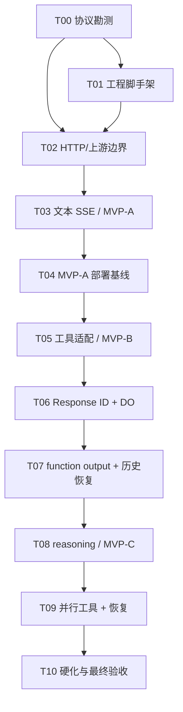

# MVP-C 开发路线图

日期：2026-06-19
状态：已同步 GitHub issues

## 1. 管理规则

- 一个任务对应一个 issue；除 Epic 外，一个 issue 原则上对应一个 PR。
- 分支命名：`codex/issue-<number>-<short-name>`。
- PR 必须写 `Closes #<number>`，列出实际验证命令和未覆盖风险。
- 后续任务依赖未满足时保留 open，并在 issue 中标记 `Blocked by #...`，不先写占位实现。
- 范围变化先更新 issue 和活动技术文档，再改代码。
- PR 合并后由 `Closes` 自动关闭 issue；Epic 用 checklist 反映总进度。
- 不直接向 `main` 推送功能代码。

## 2. 任务依赖

## 3. 任务清单

### T00 协议勘测与能力 fixture

目标：关闭技术设计 §12 的外部契约门禁。

交付：

- 固定 Codex CLI/Desktop 版本和采集步骤；
- `examples/hello-codex.md`；
- `fixtures/codex/<version>/` 文本、工具、reasoning 请求/事件；
- `fixtures/deepseek/<date>/capabilities.json`；
- `docs/deepseek-capabilities.md`。

验收：最简 Worker 完成真实 Codex hello；全部 fixture 使用合成数据且通过脱敏检查；历史模式、SSE 必填字段、模型/effort、tool choice/parallel/strict 均有明确结论。

### T01 Worker 工程脚手架与测试基线

依赖：T00 的 compatibility date 与最小契约结论。

交付：TypeScript Worker、Wrangler、Vitest/Workers test pool、lint/typecheck/test scripts、锁文件、CI。

验收：本地 Worker 健康检查成功；空实现的单元与集成测试可运行；CI 对 typecheck、test 和格式检查建立门禁。

### T02 HTTP 边界、模型策略与 DeepSeek client

依赖：T00、T01。

交付：config、router、auth、错误对象、Responses schema/normalizer、model policy、request builder、upstream client。

验收：未知字段明确 400；body 超限 413；鉴权失败 401；模型别名不可绕过；首字节/idle/总超时和 abort 有测试；日志无 secret/body。

### T03 文本 SSE 适配器（MVP-A）

依赖：T02。

交付：DeepSeek SSE decoder、Responses event builder、accumulator、stream pipeline 和文本 golden tests。

验收：任意字节切片测试通过；added/done、delta/final、output index 不变量通过；坏 chunk、断流不发送 completed；真实 Codex 文本成功。

### T04 MVP-A 部署、取消与观测基线

依赖：T03。

交付：Cloudflare 环境、secrets 配置说明、request signal flag、部署 smoke、结构化指标与回滚步骤。

验收：连续 30 次合成文本请求无 adapter 5xx；客户端取消能终止上游；上游 401/429/5xx/超时映射正确；记录 TTFT/总耗时基线。

### T05 工具 schema 与流式函数调用（MVP-B）

依赖：T04。

交付：function tool、tool choice、function call SSE、item id/call id 分离和单工具 E2E。parallel/strict 仅按 T00 结论启用。

验收：arguments 任意分片仍与最终值一致；Codex 执行单工具成功；适配器不执行工具；不支持的 strict/parallel 明确 400。

### T06 签名 Response ID 与 Conversation DO

依赖：T05。

交付：response-id、SQLite DO migration/schema、state client、begin/complete/fail、TTL alarm、export/delete、容量限制。

验收：验签/篡改/过期/key rotation 测试通过；事务和双并发测试通过；失败/取消无残留 in_progress；重启后 completed 状态可恢复。

### T07 function_call_output、历史重建与 previous_response_id

依赖：T06。

交付：call id 关联、tool output 原子消费、ConversationPlanner、parent/head 校验、previous response 恢复。

验收：未知/重复/跨 conversation call id 被拒绝；失败回合可安全重用 output；一个 assistant 的多 tool calls 聚合；重启后下一回合成功。

### T08 thinking 策略与 reasoning_content（MVP-C）

依赖：T07。

交付：effort 映射、reasoning accumulator/BLOB 持久化、工具回合原样回传、Codex reasoning presenter 决策。

验收：纯 thinking 与 thinking + tool fixtures 通过；连续两个工具子回合无 DeepSeek 400；reasoning 不进入日志或 output_text；跨模型续接默认拒绝。

### T09 并行工具、连续回合与故障恢复

依赖：T08。

交付：并行 tool index/call id 状态、交错 arguments、完成顺序变化、长输出限制、取消/断流恢复。

验收：双工具交错和逆序完成仍正确关联；并发 parent 冲突 409；tool delta 后取消能 abort 上游并关闭状态；所有失败路径无伪 completed。

### T10 安全硬化、MVP-C E2E 与操作文档

依赖：T09。

交付：完整错误矩阵、日志脱敏审计、限额测试、部署/回滚/密钥轮换/排障文档、README 使用说明、最终验收记录。

验收：技术设计 §13 全部证据存在；固定 Codex 版本完成文本、读文件、改文件、shell、单工具、双工具、连续工具和 thinking + tools；全部 CI 通过。

## 4. Issue 索引

创建 GitHub issues 后在此回写：

| ID | Issue | Phase | 依赖 |
|---|---|---|---|
| Epic | [#1 交付 DeepSeek to Codex Adapter MVP-C](https://github.com/gray0128/deepseek-2-codex-by-cloudflare/issues/1) | 全程 | - |
| Design | [#2 冻结 MVP-C 技术设计与开发路线图](https://github.com/gray0128/deepseek-2-codex-by-cloudflare/issues/2) | Foundation | Epic |
| T00 | [#3 完成协议勘测与能力 fixtures](https://github.com/gray0128/deepseek-2-codex-by-cloudflare/issues/3) | Discovery | - |
| T01 | [#4 建立 Worker 工程脚手架与测试基线](https://github.com/gray0128/deepseek-2-codex-by-cloudflare/issues/4) | Foundation | T00 |
| T02 | [#5 实现 HTTP 边界、模型策略与 DeepSeek client](https://github.com/gray0128/deepseek-2-codex-by-cloudflare/issues/5) | MVP-A | T00, T01 |
| T03 | [#6 实现文本 Responses SSE 适配器](https://github.com/gray0128/deepseek-2-codex-by-cloudflare/issues/6) | MVP-A | T02 |
| T04 | [#7 部署并验证 MVP-A 取消与观测基线](https://github.com/gray0128/deepseek-2-codex-by-cloudflare/issues/7) | MVP-A | T03 |
| T05 | [#8 实现工具 schema 与流式函数调用](https://github.com/gray0128/deepseek-2-codex-by-cloudflare/issues/8) | MVP-B | T04 |
| T06 | [#9 实现签名 Response ID 与 Conversation DO](https://github.com/gray0128/deepseek-2-codex-by-cloudflare/issues/9) | MVP-B/C state | T05 |
| T07 | [#10 实现 function_call_output 与历史恢复](https://github.com/gray0128/deepseek-2-codex-by-cloudflare/issues/10) | MVP-B | T06 |
| T08 | [#11 实现 thinking 策略与 reasoning_content](https://github.com/gray0128/deepseek-2-codex-by-cloudflare/issues/11) | MVP-C | T07 |
| T09 | [#12 实现并行工具、连续回合与故障恢复](https://github.com/gray0128/deepseek-2-codex-by-cloudflare/issues/12) | MVP-C | T08 |
| T10 | [#13 完成安全硬化、MVP-C E2E 与操作文档](https://github.com/gray0128/deepseek-2-codex-by-cloudflare/issues/13) | Release | T09 |

## 5. PR 验收模板

每个 PR 至少回答：

1. 关闭哪个 issue，是否改变原 scope；
2. 修改了哪些协议/状态不变量；
3. 执行了哪些命令和 E2E；
4. 新增或更新了哪些 fixture；
5. 是否触及 secret、日志正文、DO schema 或兼容性日期；
6. 回滚方式是什么。
